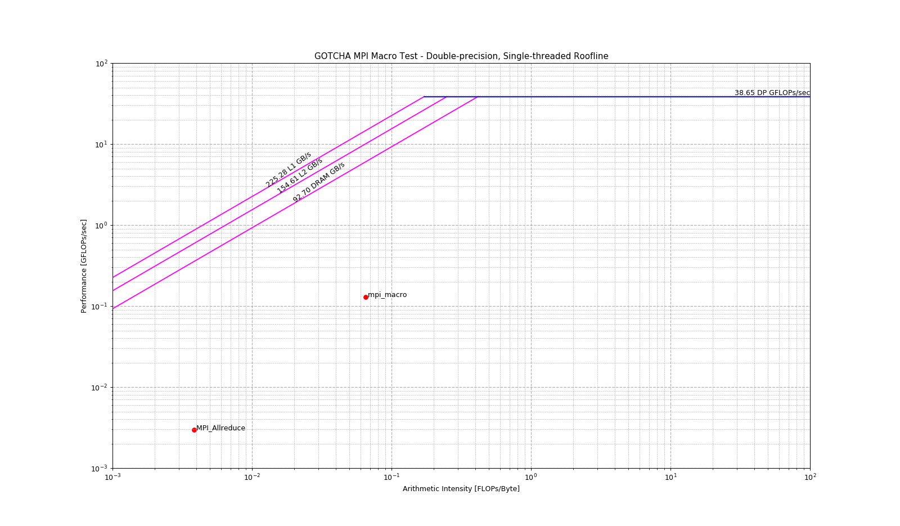
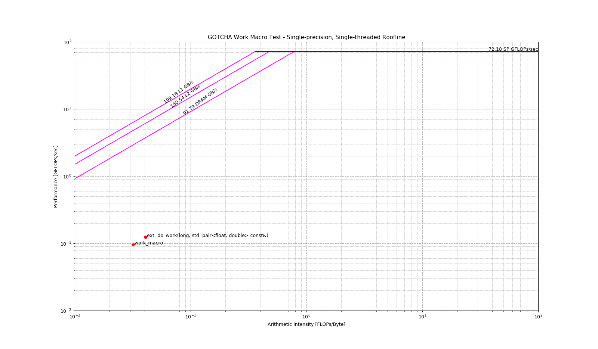

# Using GOTCHA

[GOTCHA](https://github.com/LLNL/GOTCHA) is a library that wraps functions and is used to place hook into external libraries.
It is similar to LD_PRELOAD, but operates via a programmable API.
This enables easy methods of accomplishing tasks like code instrumentation or wholesale replacement of mechanisms in programs without disrupting their source code.

The `gotcha` component in timemory supports implicit extraction of the wrapped function return type and arguments and
significantly reduces the complexity of a traditional GOTCHA specification.
Additionally, limited support for C++ function mangling required to intercept C++ function calls.

| Component Name                | Category                       | Dependences                              | Description                                           |
| ----------------------------- | ------------------------------ | ---------------------------------------- | ----------------------------------------------------- |
| **`gotcha<Size,Tools,Diff>`** | All (specify other components) | [GOTCHA](https://github.com/LLNL/GOTCHA) | Wrap external function calls with timemory components |

Requires at least two template parameters: `gotcha<Size, Tools, Diff = void>`
where `Size` is the maximum number of external functions to be wrapped,
`Tools` is a [variadic component wrapper](#variadic-component-wrappers), and
`Diff` is an optional template parameter for differentiating `gotcha` components with equivalent `Size` and `Tools`
parameters but wrap different functions. Note: the `Tools` type cannot contain other `gotcha` components.

### Use Cases

The `gotcha` component in timemory can provide either of the following functionalities:

1. Scoped instrumentation around external dynamically-linked function calls
2. Wholesale replacement of external dynamically-linked function calls


## Traditional GOTCHA in C

Writing a traditional GOTCHA wrapper in C requires a bit of work and the recommended methods require
enabling GNU compiler extensions (`-std=gnu11`) in order to simplify using the function pointers
via the `typeof` operator:

```cpp
#include <gotcha/gotcha.h>

static gotcha_wrappee_t wrappee_puts_handle;

// this is the declaration of your wrapper
static int puts_wrapper(const char* str);

static int fputs_wrapper(const char* str, FILE* f);

static gotcha_wrappee_t wrappee_fputs_handle;

struct gotcha_binding_t wrap_actions[] = {
    { "puts", puts_wrapper, &wrappee_puts_handle },
    { "fputs", fputs_wrapper, &wrappee_fputs_handle },
};

int init_mytool()
{
    gotcha_wrap(wrap_actions, sizeof(wrap_actions) / sizeof(struct gotcha_binding_t),
                "my_tool_name");
}

static int fputs_wrapper(const char* str, FILE* f)
{
    // insert clever tool logic here
    // ...

    // get my wrappee from Gotcha
    typeof(&fputs_wrapper) wrappee_fputs = gotcha_get_wrappee(wrappee_fputs_handle);
    // wrappee_fputs was directed to the original fputs by gotcha_wrap
    return wrappee_fputs(str, f);
}
```

## Using GOTCHA with timemory

A `gotcha` component in timemory has three template paramters:

1. `Size` : this is the maximum number of functions that can be wrapped by this GOTCHA instance
    - This limit exists because of the use of `std::array` instead of `std::vector` which ensures that
      a re-allocation does not invalidate any of the function pointers
2. `Components` : this is specification of the timemory components to wrap around the function, i.e.
   `component_tuple<...>`, `component_list<...>`, or `component_hybrid<...>`
    - The components specified __*cannot*__ contain another `gotcha` component
3. `Differentiator` : this is an optional template parameter (defaults to `void`) and can be any
   data type. The sole purpose of this template parameter is to differentiate between `gotcha`
   components with identical `Size` and `Components` template parameters but wrap different functions.

A GOTCHA wrapper with timemory can be defined in a single line of code and there are helper
macros provided that eliminate the need for specifying the function signature (return-type and
arguments) due to the ability for templates to extract these parameters.

## Function Replacement with GOTCHA Example

Suppose that an application is spending a signifincant amount of run-time calling the standard math library
double-precision `exp` function and you would like to investigate whether using single-precision `expf` is an
acceptable substitute in certain regions. Instead of writing the [full specification](#traditional-gotcha-in-c)
shown previously and manually enabling and disabling the wrapper in the region of interest, you can use timemory.

Provided below is the full component specification require to implement the replacement function.

```cpp
// NOTE: declared in tim::component::
struct exp_intercept : public base<exp_intercept, void>
{
    double operator()(double val)
    { return expf(static_cast<float>(val)); }
};
```

When the `exp_intercept` component is _appropriately_ configured within a `gotcha` component,
whenever `double exp(double)` is invoked, timemory will (via the GOTCHA library) redirect this function call to
`double exp_intercept::operator()(double)` -- and within this function, the replaced call to `expf` is implemented.
Configuring the `gotcha` component is slightly different, however. The goal of this component is __*optimization*__
instead of __*measurement or analysis*__ so the `gotcha` component is specified as such:

```cpp
using empty_t      = component_tuple<>;
using exp_gotcha_t = gotcha<1, empty_t, exp_intercept>;
```

In other words, we define a `gotcha` component with an empty set of measurement/analysis components and
then we specify _a component_ as the third template parameter. The _combination_ of an empty measurement/analysis
collection as the second template parameter and a component as the third template parameter trigger a special
optimized wrapper around the original function call which is explicitly designed to minimize the overhead of
the redirection to the wrapper.

All that remains is implementing the initializer that specifies which functions are wrapped by the `gotcha` component:

```cpp
__attribute__((constructor))
void init_gotcha()
{
    exp_gotcha_t::get_initializer() = [=]()
    { TIMEMORY_C_GOTCHA(exp_gotcha_t, 0, exp); };
}
```

In the above, using the constructor attribute (only available with certain compilers) creates a function
that is automatically executed before main starts. Since this function configured the gotcha within a call-back,
instead of explicitly invoking `TIMEMORY_C_GOTCHA`, the gotcha wrapper is not activated during this function,
meaning that the redirection of `exp` to `expf` is explicitly tied to the allocation of
at least one instance of `exp_gotcha_t`.

## Instrumentation with GOTCHA Example

> Reference: [source/tests/gotcha_tests.cpp](https://github.com/NERSC/timemory/blob/master/source/tests/gotcha_tests.cpp)

Lets introduce an unmangled function (i.e. `extern "C"` if compiling in C++) and a
mangled function.

The `MPI_Allreduce` has the following signature (mpich):

```cpp
int MPI_Allreduce(const void *sendbuf, void *recvbuf, int count,
                  MPI_Datatype datatype, MPI_Op op, MPI_Comm comm);
```

and is unmangled in the binary:

```console
$ nm --dynamic test_gotcha_mpi | grep MPI_Allreduce
    U MPI_Allreduce
```

An imaginary C++ function defined in an external library `do_work` has the following signature:

```cpp
std::tuple<float, double>
do_work(int, const std::pair<float, double>&);
```

and is mangled in the binary:

```console
$ nm --dynamic test_gotcha_mpi | grep do_work
    U _ZN3ext16do_work_crefEiRKSt4pairIfdE
```

### Example Setup

1. Define a component tuple for "always-on" within `gotcha` components
2. Define a component list for runtime options within `gotcha` components
3. Define a hybrid type (`gotcha_hybrid_t`) for bundling tuple and list within the `gotcha` components
4. Define a `gotcha` component (`mpi_gotcha_t`) for wrapping `MPI_Allreduce`
    - Size of 1
    - Wraps function with `gotcha_hybrid_t`
5. Define a `gotcha` component (`work_gotcha_t`) for wrapping `ext::do_work`
    - Size of 1
    - Wraps function with `gotcha_hybrid_t`
    - Uses type `int` to differentiate itself from `mpi_gotcha_t`
6. Define a component tuple for "always-on" in the application
    - Includes `mpi_gotcha_t` and `work_gotcha_t`
7. Define a component list for runtime options in the application
    - Re-use same component list as `gotcha` components
8. Define a hybrid type (`auto_hybrid_t`) for bundling tuple (includes `gotcha` components) and list in
   in the application

#### Always-on in `gotcha` components

- `real_clock`
- `cpu_clock`
- `peak_rss`

#### Optional in `gotcha` components

- `papi_array_t`
- `cpu_roofline_sp_flops`
- `cpu_roofline_dp_flops`

#### Defining hybrid type for `gotcha` components

```cpp
using gotcha_tuple_t  = component_tuple< real_clock             ,
                                         cpu_clock              ,
                                         peak_rss               >;
using gotcha_list_t   = component_list<  papi_array_t           ,
                                         cpu_roofline_sp_flops  ,
                                         cpu_roofline_dp_flops  >;
using gotcha_hybrid_t = auto_hybrid<     gotcha_tuple_t         ,
                                         gotcha_list_t          >;
```

#### Defining `gotcha` components

```cpp
using mpi_gotcha_t  = gotcha< 1, auto_hybrid_t      >;
using work_gotcha_t = gotcha< 1, auto_hybrid_t, int >;
// use 'int' to differentiate 'mpi_gotcha_t' from 'work_gotcha_t'
```

#### Defining hybrid type for application

```cpp
using tuple_t       = component_tuple< real_clock     ,
                                       cpu_clock      ,
                                       peak_rss       ,
                                       mpi_gotcha_t   ,
                                       work_gotcha_t  >;
using list_t        = gotcha_list_t;
using auto_hybrid_t = auto_hybrid<     tuple_t        ,
                                       list_t         >;
```

#### Configuring GOTCHA wrappers with a `gotcha` component

| Nomenclature | Description                                               |
| ------------ | --------------------------------------------------------- |
| `wrappee`    | The original function wrapped by the `gotcha` component   |
| `wrapper`    | The new function that adds customization around `wrappee` |

Each `gotcha` component contains a public static function `gotcha_type::configure<Index, ReturnType, Args...>`
for explicit specification of a GOTCHA wrapper.

| Template Parameter | Restrictions         | Required | Description                                                 |
| ------------------ | -------------------- | -------- | ----------------------------------------------------------- |
| `Index`            | `0 <= Index < Size`  | Yes      | The "slot" within component. Sequential order not required  |
| `ReturnType`       | Identical to wrappee | Yes      | The return type of the original function ("wrappee")        |
| `ReturnType`       | Identical to wrappee | No       | The arguments to the wrappee (must be completely identical) |


Two helper macros are provided to simplify the explicit specification for two reasons:

- Wrapping mangled functions explicitly can occasionally produce a correctly mangled name but failure to
  perfectly forward the argument types will produce a segmentation fault
    - E.g. specifying and argument as `int` when it should be `const int&`
- Functions taking aliases types will common fail to bind when the alias type changes but explicit
  specification did not use alias
    - E.g. specifying `unsigned long` instead of `uint64_t` when `uint64_t` is defined by one OS as
      `unsigned long` but another OS uses `unsigned long long`

For C functions or extern "C" (unmangled) C++ functions, the helper macro is
`TIMEMORY_C_GOTCHA(gotcha_type, Index, Function)`.
For mangled C++ functions, the helper macro is `TIMEMORY_CXX_GOTCHA(gotcha_type, Index, Function)`.

| Macro Parameter | Restrictions                       | Required |
| --------------- | ---------------------------------- | -------- |
| `gotcha_type`   | Fully specified `gotcha` component | Yes      |
| `Index`         | `0 <= Index < Size`                | Yes      |
| `Function`      | Function call w/o return or args   | Yes      |

| Function                      | Explicit                                                                         |
| :---------------------------- | :------------------------------------------------------------------------------- |
| `int MPI_Init(int*, char***)` | `gotcha_t::configure<0, int, int*, char***>("MPI_Init")`                         |
| `void modify(double&)`        | `gotcha_t::configure<1, void, double&>(mangle<decltype(modify)>("modify"))`      |
| `int& settings::get()`        | `gotcha_t::configure<2, int&>(mangle<decltype(settings::get)>("settings::get"))` |

| Function                      | Macro                                             |
| :---------------------------- | :------------------------------------------------ |
| `int MPI_Init(int*, char***)` | `TIMEMORY_C_GOTCHA(gotcha_t, 0, MPI_Init)`        |
| `void modify(double&)`        | `TIMEMORY_CXX_GOTCHA(gotcha_t, 1, modify)`        |
| `int& settings::get()`        | `TIMEMORY_CXX_GOTCHA(gotcha_t, 2, settings::get)` |

### Testing `MPI_Allreduce` gotcha

The `details::generate` function using a RNG to generate 1000 random entries and `details::allreduce`
calls `MPI_Allreduce` with `MPI_SUM` and the appropriate `MPI_FLOAT` or `MPI_DOUBLE`.

```cpp
TEST_F(gotcha_tests, mpi_macro)
{
    // configure callback when mpi_gotcha_t is activated
    mpi_gotcha_t::get_initializer() = []()
    {
        TIMEMORY_C_GOTCHA(mpi_gotcha_t, 0, MPI_Allreduce);
    };

    TIMEMORY_BLANK_POINTER(auto_hybrid_t, details::get_test_name());

    auto rank = tim::mpi::rank();
    auto size = tim::mpi::size();

    float  fsum = 0.0;
    double dsum = 0.0;
    for(int i = 0; i < nitr; ++i)
    {
        auto fsendbuf = details::generate<float>(1000);
        auto frecvbuf = details::allreduce(fsendbuf);
        fsum += std::accumulate(frecvbuf.begin(), frecvbuf.end(), 0.0);

        auto dsendbuf = details::generate<double>(1000);
        auto drecvbuf = details::allreduce(dsendbuf);
        dsum += std::accumulate(drecvbuf.begin(), drecvbuf.end(), 0.0);
    }

    for(int i = 0; i < size; ++i)
    {
        tim::mpi::barrier();
        if(i == rank)
        {
            printf("[%i]> single-precision sum = %8.2f\n", rank, fsum);
            printf("[%i]> double-precision sum = %8.2f\n", rank, dsum);
        }
        tim::mpi::barrier();
    }
}
```

### Testing `do_work` gotcha

The implementation of `ext::do_work` sums 1000 iterations of `cos` or `cosf`
on a value and then increments the value by `i * p.first` or `i * p.second` where
`i` is the iteration number.

```cpp
TEST_F(gotcha_tests, work_macro)
{
    // configure callback when work_gotcha_t is activated
    work_gotcha_t::get_initializer() = []()
    {
        TIMEMORY_CXX_GOTCHA(work_gotcha_t, 0, ext::do_work);
    };

    TIMEMORY_BLANK_POINTER(auto_hybrid_t, details::get_test_name());

    float  fsum = 0.0;
    double dsum = 0.0;
    for(int i = 0; i < nitr; ++i)
    {
        auto ret = ext::do_work(1000, pair_t(0.25, 0.125));
        fsum += std::get<0>(ret);
        dsum += std::get<1>(ret);
    }

    auto rank = tim::mpi::rank();
    printf("[%i]> single-precision sum = %8.2f\n", rank, fsum);
    printf("[%i]> double-precision sum = %8.2f\n", rank, dsum);
}
```

### Default Behavior

#### MPI Test Command

```console
./source/tests/gotcha_tests --gtest_filter=gotcha_tests.mpi_macro
```

#### MPI Test Output

```console
[0]> single-precision sum = 50003576.00
[0]> double-precision sum = 50003802.88

[real]> Outputting 'timemory-gotcha-tests-output/real_0.txt'... Done

|0> [cxx] mpi_macro       :     2.646358 sec real,      1 laps, depth 0 (exclusive:  88.5%)
|0> [cxx] |_MPI_Allreduce :     0.303283 sec real, 200000 laps, depth 1

[cpu]> Outputting 'timemory-gotcha-tests-output/cpu_0.txt'... Done

|0> [cxx] mpi_macro       :     2.650000 sec cpu,      1 laps, depth 0 (exclusive:  86.8%)
|0> [cxx] |_MPI_Allreduce :     0.350000 sec cpu, 200000 laps, depth 1

[peak_rss]> Outputting 'timemory-gotcha-tests-output/peak_rss_0.txt'... Done

|0> [cxx] mpi_macro       : 50256.000000 KB peak_rss,      1 laps, depth 0 (exclusive: 100.0%)
|0> [cxx] |_MPI_Allreduce :     0.000000 KB peak_rss, 200000 laps, depth 1
```

#### Work Test Command

```console
./source/tests/gotcha_tests --gtest_filter=gotcha_tests.work_macro
```

#### Work Test Output

```console
[0]> single-precision sum = -2416347.50
[0]> double-precision sum = -1829370.79

[real]> Outputting 'timemory-gotcha-tests-output/real_0.txt'... Done

|0> [cxx] work_macro                                            :     2.879349 sec real,      1 laps, depth 0 (exclusive:  16.6%)
|0> [cxx] |_ext::do_work(long, std::pair<float, double> const&) :     2.401164 sec real, 100000 laps, depth 1

[cpu]> Outputting 'timemory-gotcha-tests-output/cpu_0.txt'... Done

|0> [cxx] work_macro                                            :     2.870000 sec cpu,      1 laps, depth 0 (exclusive:  16.7%)
|0> [cxx] |_ext::do_work(long, std::pair<float, double> const&) :     2.390000 sec cpu, 100000 laps, depth 1

[peak_rss]> Outputting 'timemory-gotcha-tests-output/peak_rss_0.txt'... Done

|0> [cxx] work_macro                                            : 13312.000000 KB peak_rss,      1 laps, depth 0 (exclusive: 100.0%)
|0> [cxx] |_ext::do_work(long, std::pair<float, double> const&) :     0.000000 KB peak_rss, 100000 laps, depth 1
```

### Enabling PAPI

#### MPI Test + PAPI_DP_OPS Command

```console
export TIMEMORY_COMPONENT_LIST_INIT="papi_array"
export TIMEMORY_PAPI_EVENTS="PAPI_DP_OPS"
./source/tests/gotcha_tests --gtest_filter=gotcha_tests.mpi_macro
```

#### MPI Test + PAPI_DP_OPS Output

```console
[0]> single-precision sum = 50004212.00
[0]> double-precision sum = 49998991.47

[papi-1]> Outputting 'timemory-gotcha-tests-output/papi-1_0.txt'... Done

|0> [cxx] mpi_macro       :    401800004 DP operations papi-1,      1 laps, depth 0 (exclusive:  99.8%)
|0> [cxx] |_MPI_Allreduce :       800000 DP operations papi-1, 200000 laps, depth 1

[real]> Outputting 'timemory-gotcha-tests-output/real_0.txt'... Done

|0> [cxx] mpi_macro       :     3.216234 sec real,      1 laps, depth 0 (exclusive:  87.5%)
|0> [cxx] |_MPI_Allreduce :     0.400651 sec real, 200000 laps, depth 1

[cpu]> Outputting 'timemory-gotcha-tests-output/cpu_0.txt'... Done

|0> [cxx] mpi_macro       :     3.210000 sec cpu,      1 laps, depth 0 (exclusive:  87.9%)
|0> [cxx] |_MPI_Allreduce :     0.390000 sec cpu, 200000 laps, depth 1

[peak_rss]> Outputting 'timemory-gotcha-tests-output/peak_rss_0.txt'... Done

|0> [cxx] mpi_macro       : 50552.000000 KB peak_rss,      1 laps, depth 0 (exclusive: 100.0%)
|0> [cxx] |_MPI_Allreduce :     0.000000 KB peak_rss, 200000 laps, depth 1
```

#### Work Test + PAPI_DP_OPS Command

```console
export TIMEMORY_COMPONENT_LIST_INIT="papi_array"
export TIMEMORY_PAPI_EVENTS="PAPI_DP_OPS"
./source/tests/gotcha_tests --gtest_filter=gotcha_tests.work_macro
```

#### Work Test + PAPI_DP_OPS Output

```console
[0]> single-precision sum = -2416347.50
[0]> double-precision sum = -1829370.79

[papi-1]> Outputting 'timemory-gotcha-tests-output/papi-1_0.txt'... Done

|0> [cxx] work_macro                                            :   6260000004 DP operations papi-1,      1 laps, depth 0 (exclusive:   0.0%)
|0> [cxx] |_ext::do_work(long, std::pair<float, double> const&) :   6259500000 DP operations papi-1, 100000 laps, depth 1

[real]> Outputting 'timemory-gotcha-tests-output/real_0.txt'... Done

|0> [cxx] work_macro                                            :     3.490665 sec real,      1 laps, depth 0 (exclusive:  24.0%)
|0> [cxx] |_ext::do_work(long, std::pair<float, double> const&) :     2.653306 sec real, 100000 laps, depth 1

[cpu]> Outputting 'timemory-gotcha-tests-output/cpu_0.txt'... Done

|0> [cxx] work_macro                                            :     3.490000 sec cpu,      1 laps, depth 0 (exclusive:  26.4%)
|0> [cxx] |_ext::do_work(long, std::pair<float, double> const&) :     2.570000 sec cpu, 100000 laps, depth 1

[peak_rss]> Outputting 'timemory-gotcha-tests-output/peak_rss_0.txt'... Done

|0> [cxx] work_macro                                            : 13404.000000 KB peak_rss,      1 laps, depth 0 (exclusive: 100.0%)
|0> [cxx] |_ext::do_work(long, std::pair<float, double> const&) :     0.000000 KB peak_rss, 100000 laps, depth 1
```

### Enabling CPU Roofline

#### MPI Test + Double-Precision Roofline Command

```console
export TIMEMORY_COMPONENT_LIST_INIT="cpu_roofline_dp_flops"
export TIMEMORY_ROOFLINE_MODE="op"
./source/tests/gotcha_tests --gtest_filter=gotcha_tests.mpi_macro
export TIMEMORY_ROOFLINE_MODE="ai"
./source/tests/gotcha_tests --gtest_filter=gotcha_tests.mpi_macro
```

#### MPI Test + Double-Precision Roofline Output

```console
[0]> single-precision sum = 49997152.00
[0]> double-precision sum = 49995907.40

[ert::executor]> working-set = 64, max-size = 31457280, num-thread = 1, num-stream = 0, grid-size = 0, block-size = 0, align-size = 64, data-type = double

[cpu_roofline_op]> Outputting 'timemory-gotcha-tests-output/cpu_roofline_op_0.txt'... Done
[cpu_roofline_op]> Outputting 'timemory-gotcha-tests-output/cpu_roofline_op_0.json'... Done

|0> [cxx] mpi_macro       :     3.215877 sec real, 125315736.339528 (DP operations) / sec,      1 laps, depth 0 (exclusive:  97.8%)
|0> [cxx] |_MPI_Allreduce :     0.360500 sec real, 2773925.735022 (DP operations) / sec, 200000 laps, depth 1

[real]> Outputting 'timemory-gotcha-tests-output/real_0.txt'... Done
[real]> Outputting 'timemory-gotcha-tests-output/real_0.json'... Done

|0> [cxx] mpi_macro       :     3.215669 sec real,      1 laps, depth 0 (exclusive:  86.6%)
|0> [cxx] |_MPI_Allreduce :     0.431685 sec real, 200000 laps, depth 1

[cpu]> Outputting 'timemory-gotcha-tests-output/cpu_0.txt'... Done
[cpu]> Outputting 'timemory-gotcha-tests-output/cpu_0.json'... Done

|0> [cxx] mpi_macro       :     3.220000 sec cpu,      1 laps, depth 0 (exclusive:  86.6%)
|0> [cxx] |_MPI_Allreduce :     0.430000 sec cpu, 200000 laps, depth 1

[peak_rss]> Outputting 'timemory-gotcha-tests-output/peak_rss_0.txt'... Done
[peak_rss]> Outputting 'timemory-gotcha-tests-output/peak_rss_0.json'... Done

|0> [cxx] mpi_macro       : 50816.000000 KB peak_rss,      1 laps, depth 0 (exclusive: 100.0%)
|0> [cxx] |_MPI_Allreduce :     0.000000 KB peak_rss, 200000 laps, depth 1
```

```console
[0]> single-precision sum = 50004272.00
[0]> double-precision sum = 49999650.33

[ert::executor]> working-set = 64, max-size = 31457280, num-thread = 1, num-stream = 0, grid-size = 0, block-size = 0, align-size = 64, data-type = double

[cpu_roofline_ai]> Outputting 'timemory-gotcha-tests-output/cpu_roofline_ai_0.txt'... Done
[cpu_roofline_ai]> Outputting 'timemory-gotcha-tests-output/cpu_roofline_ai_0.json'... Done

|0> [cxx] mpi_macro       :     2.993197 sec real, 6160853780.000000 (L/S completed),      1 laps, depth 0 (exclusive:  59.5%)
|0> [cxx] |_MPI_Allreduce :     0.313040 sec real, 260801261.000000 (L/S completed), 200000 laps, depth 1

[real]> Outputting 'timemory-gotcha-tests-output/real_0.txt'... Done
[real]> Outputting 'timemory-gotcha-tests-output/real_0.json'... Done

|0> [cxx] mpi_macro       :     2.992866 sec real,      1 laps, depth 0 (exclusive:  87.4%)
|0> [cxx] |_MPI_Allreduce :     0.378349 sec real, 200000 laps, depth 1

[cpu]> Outputting 'timemory-gotcha-tests-output/cpu_0.txt'... Done
[cpu]> Outputting 'timemory-gotcha-tests-output/cpu_0.json'... Done

|0> [cxx] mpi_macro       :     2.980000 sec cpu,      1 laps, depth 0 (exclusive:  88.6%)
|0> [cxx] |_MPI_Allreduce :     0.340000 sec cpu, 200000 laps, depth 1

[peak_rss]> Outputting 'timemory-gotcha-tests-output/peak_rss_0.txt'... Done
[peak_rss]> Outputting 'timemory-gotcha-tests-output/peak_rss_0.json'... Done

|0> [cxx] mpi_macro       : 50720.000000 KB peak_rss,      1 laps, depth 0 (exclusive: 100.0%)
|0> [cxx] |_MPI_Allreduce :     0.000000 KB peak_rss, 200000 laps, depth 1
```

#### MPI Test + Double-Precision Roofline Plot



#### Work Test + Single-Precision Roofline Command

```console
export TIMEMORY_COMPONENT_LIST_INIT="cpu_roofline_sp_flops"
export TIMEMORY_ROOFLINE_MODE="op"
./source/tests/gotcha_tests --gtest_filter=gotcha_tests.work_macro
export TIMEMORY_ROOFLINE_MODE="ai"
./source/tests/gotcha_tests --gtest_filter=gotcha_tests.work_macro
```

#### Work Test + Single-Precision Roofline Output

```console
[0]> single-precision sum = -2416347.50
[0]> double-precision sum = -1829370.79

[ert::executor]> working-set = 64, max-size = 31457280, num-thread = 1, num-stream = 0, grid-size = 0, block-size = 0, align-size = 64, data-type = float

[cpu_roofline_op]> Outputting 'timemory-gotcha-tests-output/cpu_roofline_op_0.txt'... Done
[cpu_roofline_op]> Outputting 'timemory-gotcha-tests-output/cpu_roofline_op_0.json'... Done

|0> [cxx] work_macro                                            :     3.070875 sec real, 97659471.010205 (SP operations) / sec,      1 laps, depth 0
|0> [cxx] |_ext::do_work(long, std::pair<float, double> const&) :     2.414884 sec real, 124146740.673063 (SP operations) / sec, 100000 laps, depth 1

[real]> Outputting 'timemory-gotcha-tests-output/real_0.txt'... Done

|0> [cxx] work_macro                                            :     3.070598 sec real,      1 laps, depth 0 (exclusive:  20.9%)
|0> [cxx] |_ext::do_work(long, std::pair<float, double> const&) :     2.427928 sec real, 100000 laps, depth 1

[cpu]> Outputting 'timemory-gotcha-tests-output/cpu_0.txt'... Done

|0> [cxx] work_macro                                            :     3.070000 sec cpu,      1 laps, depth 0 (exclusive:  19.2%)
|0> [cxx] |_ext::do_work(long, std::pair<float, double> const&) :     2.480000 sec cpu, 100000 laps, depth 1

[peak_rss]> Outputting 'timemory-gotcha-tests-output/peak_rss_0.txt'... Done

|0> [cxx] work_macro                                            : 13392.000000 KB peak_rss,      1 laps, depth 0 (exclusive: 100.0%)
|0> [cxx] |_ext::do_work(long, std::pair<float, double> const&) :     0.000000 KB peak_rss, 100000 laps, depth 1
```

```console
[0]> single-precision sum = -2416347.50
[0]> double-precision sum = -1829370.79

[ert::executor]> working-set = 64, max-size = 31457280, num-thread = 1, num-stream = 0, grid-size = 0, block-size = 0, align-size = 64, data-type = float

[cpu_roofline_ai]> Outputting 'timemory-gotcha-tests-output/cpu_roofline_ai_0.txt'... Done
[cpu_roofline_ai]> Outputting 'timemory-gotcha-tests-output/cpu_roofline_ai_0.json'... Done

|0> [cxx] work_macro                                            :     3.123588 sec real, 9426961903.000000 (L/S completed),      1 laps, depth 0 (exclusive:   1.1%)
|0> [cxx] |_ext::do_work(long, std::pair<float, double> const&) :     2.457765 sec real, 7338005721.000000 (L/S completed), 100000 laps, depth 1

[real]> Outputting 'timemory-gotcha-tests-output/real_0.txt'... Done

|0> [cxx] work_macro                                            :     3.123375 sec real,      1 laps, depth 0 (exclusive:  21.1%)
|0> [cxx] |_ext::do_work(long, std::pair<float, double> const&) :     2.465038 sec real, 100000 laps, depth 1

[cpu]> Outputting 'timemory-gotcha-tests-output/cpu_0.txt'... Done

|0> [cxx] work_macro                                            :     3.130000 sec cpu,      1 laps, depth 0 (exclusive:  18.5%)
|0> [cxx] |_ext::do_work(long, std::pair<float, double> const&) :     2.550000 sec cpu, 100000 laps, depth 1

[peak_rss]> Outputting 'timemory-gotcha-tests-output/peak_rss_0.txt'... Done

|0> [cxx] work_macro                                            : 13420.000000 KB peak_rss,      1 laps, depth 0 (exclusive: 100.0%)
|0> [cxx] |_ext::do_work(long, std::pair<float, double> const&) :     0.000000 KB peak_rss, 100000 laps, depth 1
```

#### Work Test + Single-Precision Roofline Plot


