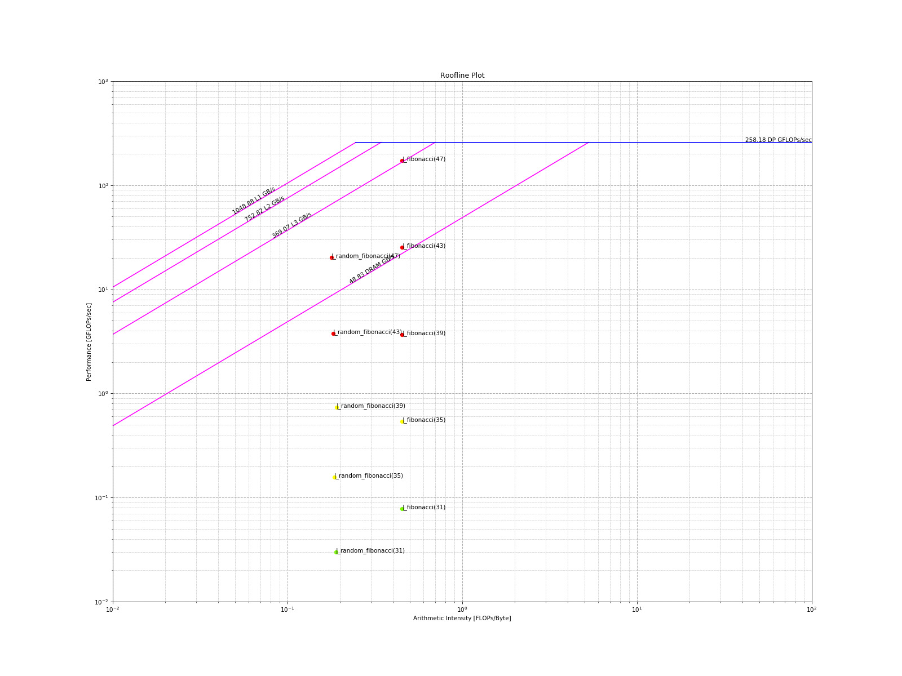

# Roofline

An overview of the roofline components can be found [here](../components.md#roofline-components).

In general, a roofline plot requires measuring two quantities (NOTE: MOI == metric-of-interest):

1. Performance: MOI per unit time, e.g. GFLOPs/sec
2. Arithmetic Intensity (AI): MOI per byte, e.g. FLOPs/byte

## Generating Roofline Data

Assuming the code contains a `tim::component::cpu_roofline<...>`:

```bash
# enable JSON output
export TIMEMORY_JSON_OUTPUT=ON
# execute and enable hardware counters for arithmetic intensity
TIMEMORY_ROOFLINE_MODE=ai ./test_cxx_roofline
# execute and enable hardware counters for operations
TIMEMORY_ROOFLINE_MODE=op ./test_cxx_roofline
```

## Roofline Python Module: `timemory.roofline`



### Generating Roofline Plot with `timemory.roofline`

Currently, some hardware counters cannot be accumulated in a single-pass and as a result,
the application must be executed twice to generate a roofline plot:

```bash
python -m timemory.roofline \
    -ai timemory-test-cxx-roofline-output/cpu_roofline_ai.json \
    -op timemory-test-cxx-roofline-output/cpu_roofline_op.json \
    -d
```

| Option                          | Type              | Description                      |
| ------------------------------- | ----------------- | -------------------------------- |
| `-ai`, `--arithmetic-intensity` | File              | Input JSON with AI data          |
| `-op`, `--operations`           | File              | Input JSON with Operation data   |
| `-d`, `--display`               | bool              | Open a window with the plot      |
| `-o`, `--output-file`           | String            | Output filename of roofline plot |
| `-D`, `--output-dir`            | String            | Output directory for plot        |
| `--format`                      | Image file suffix | Image format to render           |

### Executing an Application with `timemory.roofline`

```bash
python -m timemory.roofline -- ./test_cxx_roofline
```

| Option                | Type       | Description                                            |
| --------------------- | ---------- | ------------------------------------------------------ |
| `-p`, `--preload`     | bool       | Enable `libtimemory-preload`                           |
| `-k`, `--keep-going`  | bool       | Continue even if execution returned non-zero exit code |
| `-t`, `--rtype`       | Label      | Roofline type                                          |
| `-r`, `--rerun`       | `ai`, `op` | Re-run this mode and not the other mode                |
| `-d`, `--display`     | bool       | Open a window with the plot                            |
| `-o`, `--output-file` | bool       | Output filename of roofline plot                       |
| `-D`, `--output-dir`  | bool       | Output directory for plot                              |
| `--format`            | bool       | Image format to render                                 |

## Customizing the calculation of the "roof" for the Roofline

TiMemory will run a customizable set of calculations at the conclusion of the application of calculate these
peak ("roof") values. This functionality is provided through the `tim::policy::global_finalize`
[policy](custom_components.md#policies).
The default behavior of the roofline is targeted towards the multithreaded FMA
(fused-multiply-add) peak and calculates the bandwidth limitations for L1, L2, L3, and DRAM.

## Configuring number of threads in the Roofline

| Environment Variable            | Function                                                     |
| ------------------------------- | ------------------------------------------------------------ |
| `TIMEMORY_ROOFLINE_NUM_THREADS` | `std::function<uint64_t()>& get_finalize_threads_function()` |

Example:

```cpp
cpu_roofline_dp_flops::get_finalize_threads_function() = []() { return 1; };
```

## Full Customization of the Roofline Model

Full customization of the roofline model can be accomplished by changing the `get_finalize_function()` of
the roofline component. See documentation on [exec_params](#execution-parameters) and [operation_counter](#operation-counter)
for more detail about these types.

```cpp
    // overload the finalization function that runs ERT calculations
    tim::component::cpu_roofline_dp_flops::get_finalize_function() = [=]() {

        // these are the kernel functions we want to calculate the peaks with
        auto store_func = [](double& a, const double& b) { a = b; };
        auto add_func   = [](double& a, const double& b, const double& c) { a = b + c; };
        auto fma_func   = [](double& a, const double& b, const double& c) { a = a * b + c; };

        // test getting the cache info
        auto    lm_size       = tim::ert::cache_size::get_max();
        int64_t num_threads   = 1;
        int64_t working_size  = 16;
        int64_t memory_factor = 8;
        int64_t alignment     = 64;

        // create the execution parameters
        tim::ert::exec_params params(working_size, memory_factor * lm_size, num_threads);

        // create the operation counter
        auto op_counter = new tim::ert::cpu::operation_counter<double>(params, alignment);

        // set bytes per element
        op_counter->bytes_per_element = sizeof(double);

        // set number of memory accesses per element from two functions
        op_counter->memory_accesses_per_element = 2;

        // run the operation counter kernels
        tim::ert::cpu_ops_main<1>(*op_counter, add_func, store_func);
        tim::ert::cpu_ops_main<4, 5, 6, 7, 8>(*op_counter, fma_func, store_func);

        // return this data for processing
        return op_counter;
    };
```

### Execution Parameters

> Class: `tim::ert::exec_params`

| Member variable   | Description                             |
| ----------------- | --------------------------------------- |
| `working_set_min` | Minimum size of the working set of data |
| `memory_max`      | Maximum amount of data                  |
| `nthreads`        | Number of threads (const)               |
| `nrank`           | Process rank (const)                    |
| `nproc`           | Total number of processes (const)       |

### Operation Counter

> Class: `tim::ert::cpu::operation_counter<_Tp, _Counter>`

- where `_Tp` is the data type, e.g. `double`
- where `_Counter` is the measurement type used for delta of roofline function execution, e.g. `tim::component::real_clock`

```cpp
tim::ert::cpu::operation_counter<double, tim::component::real_clock>;
```

| Member variable               | Description                                               |
| ----------------------------- | --------------------------------------------------------- |
| `params`                      | Execution parameters                                      |
| `bytes_per_element`           | Number of bytes consumed by type in buffer                |
| `memory_accesses_per_element` | Number of memory accesses that occur in roofline function |
| `align`                       | Alignment of data in buffer                               |
| `nsize`                       | Size of data buffer                                       |
| `counter_units`               | Units of `_Counter` type                                  |

### `cpu_ops_main<...>`

The `cpu_ops_main` function is designed to take 3 parameters:

1. A "counter" for recording number of operations, memory bandwidth(s), and the timing to complete these tasks
2. A "compute" function designed to emulate the applications ideal computational model
3. A "store" function designed to emulate the applications ideal memory-access model

and executes the amount of work specified by the execution parameters and operation counter
instances. It is a fully variadic function call where the integer specified in the template
parameters corresponds to a compile-time constant loop unrolling of the compute function
(`add_func` and `fma_func` in the above). In other words, if the integer template parameter
has a value of 4, this means that compute function is invoked 4 times; if the value is 5,
the compute functions is invoked 5 times, and so on.

Ultimately, only `tim::ert::cpu::operation_counter<_Tp, _Counter>` is seen by the `cpu_roofline`
component so the structure of `cpu_ops_main` and the kernels it invokes are entirely up to the
user.

### Thread Barrier

The `tim::ert::thread_barrier` type is provided as a one-time synchronization point for a specified
number of threads. This object should be constructed by a master thread with a specified number of
worker threads and should not participate in this work. An example of it's usage can be viewed here
where two synchronization points are desired: before the work and after the work:

```cpp
int nthreads = 4;

// create synchronization barriers for the worker threads on master
tim::ert::thread_barrier fbarrier(nthreads);
tim::ert::thread_barrier lbarrier(nthreads);

auto do_sleep = [](uint64_t i, tim::ert::thread_barrier* before, tim::ert::thread_barrier* after)
{
    // threads spin here (actively waiting) until all 4 threads are ready
    before->spin_wait();

    // threads wait different amounts of time
    std::this_thread::sleep_for(std::chrono::seconds(i + 1));

    after->cv_wait();
    // threads wait here on condition_variable (goes to sleep) until all 4 threads are finished
};

// container of worker threads
std::vector<std::thread> threads;

// master thread launches workers
for(uint64_t i = 0; i < nthreads; ++i)
    threads.push_back(std::thread(do_sleep, i, &fbarrier, &lbarrier));

// master thread waits for all workers to finish
for(auto& itr : threads)
    itr.join();
```
