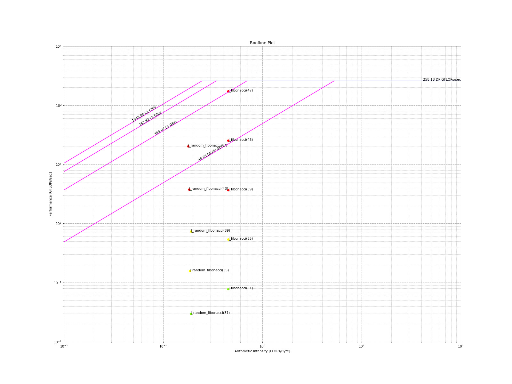

# Roofline

An overview of the roofline components can be found [here](components.md#roofline-components).

In general, a roofline plot requires measuring two quantities (NOTE: MOI == metric-of-interest):

1. Performance: MOI per unit time, e.g. GFLOPs/sec
2. Arithmetic Intensity (AI): MOI per byte, e.g. FLOPs/byte

## Generating Roofline Plot

Currently, some hardware counters cannot be accumulated in a single-pass and as a result,
the application must be executed twice to generate a roofline plot:

```bash
export TIMEMORY_JSON_OUTPUT=ON
TIMEMORY_ROOFLINE_MODE=ai ./test_cxx_roofline
TIMEMORY_ROOFLINE_MODE=op ./test_cxx_roofline
python -m timemory.roofline \
    -ai timemory-test-cxx-roofline-output/cpu_roofline_ai.json \
    -op timemory-test-cxx-roofline-output/cpu_roofline_op.json \
    -d
```



## Cache Information

TiMemory provides method on Linux, Windows, and macOS to query the size of L1, L2, and L3 cache.
A `get_max()` function is provided for convenience as some systems (e.g. KNL) do not have an L3 cache.

> Namespace: `tim::ert::cache_size`

| Cache level | Function(s)                                                      |
| ----------- | ---------------------------------------------------------------- |
| L1          | `tim::ert::cache_size::get(1)`, `tim::ert::cache_size::get<1>()` |
| L2          | `tim::ert::cache_size::get(2)`, `tim::ert::cache_size::get<2>()` |
| L3          | `tim::ert::cache_size::get(3)`, `tim::ert::cache_size::get<3>()` |
| max         | `tim::ert::cache_size::get_max()`                                |

## Calculating the "roof" of the Roofline

TiMemory will run a customizable set of calculations at the conclusion of the application of calculate these
peak ("roof") values. This functionality is provided through the `tim::policy::global_finalize`
[policy](customization.md#policies).
The default behavior of the roofline is targeted towards the multithreaded FMA
(fused-multiply-add) peak and calculates the bandwidth limitations for L1, L2, L3, and DRAM.

### Configuring number of threads

| Environment Variable            | Function                                                     |
| ------------------------------- | ------------------------------------------------------------ |
| `TIMEMORY_ROOFLINE_NUM_THREADS` | `std::function<uint64_t()>& get_finalize_threads_function()` |

Example:

```cpp
cpu_roofline_dp_flops::get_finalize_threads_function() = []() { return 1; };
```

### Custom Roofline Model

Full customization of the roofline model can be accomplished by changing the `get_finalize_function()` of
the roofline component. See documentation on [exec_params](#execution-parameters) and [operation_counter](#operation-counter)
for more detail about these types.

```cpp
    // overload the finalization function that runs ERT calculations
    tim::component::cpu_roofline_dp_flops::get_finalize_function() = [=]() {

        // these are the kernel functions we want to calculate the peaks with
        auto store_func = [](double& a, const double& b) { a = b; };
        auto add_func   = [](double& a, const double& b, const double& c) { a = b + c; };
        auto fma_func   = [](double& a, const double& b, const double& c) { a = a * b + c; };

        // test getting the cache info
        auto    lm_size       = tim::ert::cache_size::get_max();
        int64_t num_threads   = 1;
        int64_t working_size  = 16;
        int64_t memory_factor = 8;
        int64_t alignment     = 64;

        // create the execution parameters
        tim::ert::exec_params params(working_size, memory_factor * lm_size, num_threads);

        // create the operation counter
        auto op_counter = new tim::ert::cpu::operation_counter<double>(params, alignment);

        // set bytes per element
        op_counter->bytes_per_element = sizeof(double);

        // set number of memory accesses per element from two functions
        op_counter->memory_accesses_per_element = 2;

        // run the operation counter kernels
        tim::ert::cpu_ops_main<1>(*op_counter, add_func, store_func);
        tim::ert::cpu_ops_main<4, 5, 6, 7, 8>(*op_counter, fma_func, store_func);

        // return this data for processing
        return op_counter;
    };
```

### Execution Parameters

> Class: `tim::ert::exec_params`

| Member variable   | Description                             |
| ----------------- | --------------------------------------- |
| `working_set_min` | Minimum size of the working set of data |
| `memory_max`      | Maximum amount of data                  |
| `nthreads`        | Number of threads (const)               |
| `nrank`           | Process rank (const)                    |
| `nproc`           | Total number of processes (const)       |

### Operation Counter

> Class: `tim::ert::cpu::operation_counter<_Tp, _Counter>`

- where `_Tp` is the data type, e.g. `double`
- where `_Counter` is the measurement type used for delta of roofline function execution, e.g. `tim::component::real_clock`

```cpp
tim::ert::cpu::operation_counter<double, tim::component::real_clock>;
```

| Member variable               | Description                                               |
| ----------------------------- | --------------------------------------------------------- |
| `params`                      | Execution parameters                                      |
| `bytes_per_element`           | Number of bytes consumed by type in buffer                |
| `memory_accesses_per_element` | Number of memory accesses that occur in roofline function |
| `align`                       | Alignment of data in buffer                               |
| `nsize`                       | Size of data buffer                                       |
| `counter_units`               | Units of `_Counter` type                                  |

